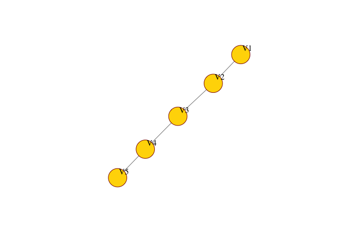

<!-- README.md is generated from README.Rmd. Please edit that file -->

# CausNet

<!-- badges: start -->

<!-- badges: end -->

The goal of causnet is to fond globally optimal Bayesian networks via
dynamic programming with parent set constraints.

## Installation

You can install the development version from GitHub with:

``` r
require("devtools")
install_github("https://github.com/nand1155/CausNet")
```

## Example

``` r
library(CausNet)
# simulate data
set.seed(1234)
mydata = simdat(300,5,1)
# run Causnet
links.s = sfun(mydata,  surdata=NULL, scoreFn = "bic", pheno = FALSE, fdr = FALSE, alpha = 0.6, alpha1 = NULL, alpha2 = NULL, pp = NULL, multBNs = TRUE)
netplot_jm(links.s[[1]]) # if multBNs = TRUE
#> IGRAPH 727d4ec DN-- 5 4 -- 
#> + attr: name (v/c)
#> + edges from 727d4ec (vertex names):
#> [1] V4->V5 V3->V4 V2->V3 V1->V2
```



``` r
# netplot_jm(links.s) # if multBNs = False
```
